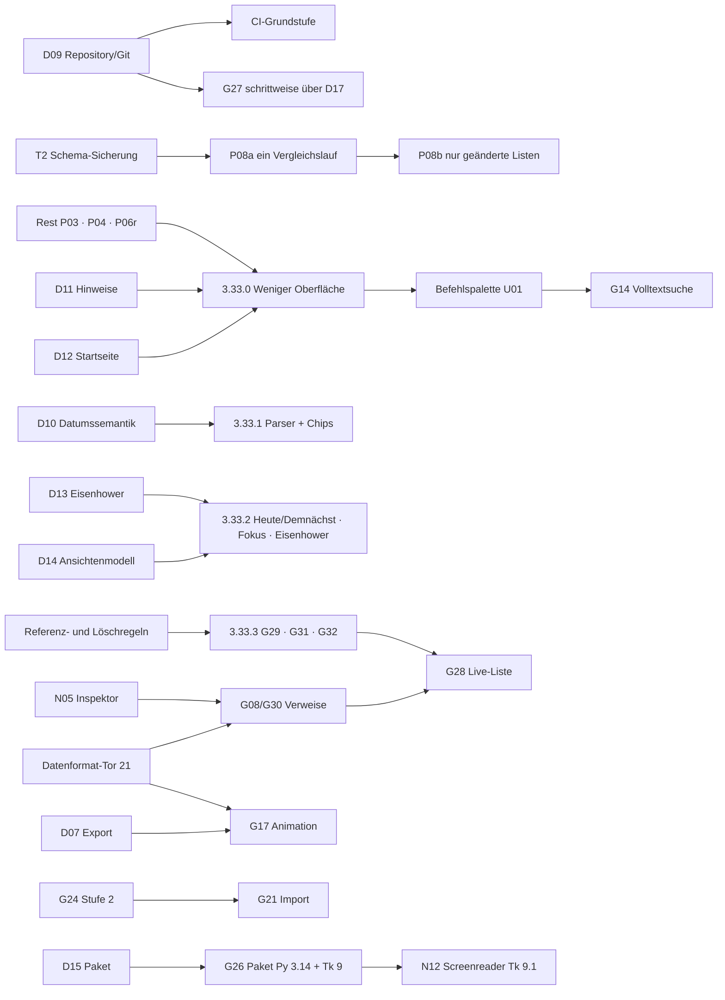

# Glide – Entwicklungsplan ab 3.33

Stand **01.10.2026** · Glide 3.32.3 (Aufgabenformat 20) · Teil 4 von 4 der Analyse vom 01.10.2026

Grundlagen:
- [Bestandsaufnahme Code und Dokumentation](Glide_Bestandsaufnahme_Code_und_Dokumentation_2026-10-01.md): Abweichungen AB01–AB17, technische Befunde T1–T7, Ablage
- [Konkurrenz- und Featurematrix](Glide_Konkurrenz_und_Featurematrix_2026-10-01.md): Vorschläge N01–N20
- [Produktprinzipien und UX-Prüfung](Glide_Produktprinzipien_und_UX-Pruefung_2026-10-01.md): Befunde U01–U24
- [Entscheidungsvorlage D09–D17](Glide_Entscheidungsvorlage_2026-10-01.md)
- bestehende Planung:
  - [Arbeits- und Featureplanung](Glide_Arbeits_und_Featureplanung_2026-09-30.md) (D01–D08, G-, P-Kennungen)
  - [Funktionsrecherche](Glide_Funktionsrecherche_Ausbau_2026-09-30.md) (G01–G32, Q1–Q5)
  - [Aufgabenauswahl](Glide_Aufgabenauswahl_nach_3.32.2_2026-09-30.md) (A-01 bis H-03)
  - [Arbeitsrichtung](../01_Repository/Glide/docs/ARBEITSRICHTUNG.md)

## 0. Verbindlichkeit

- **Verbindlich bleiben:**
  - D01–D08 und die Antworten Q1–Q5,
  - die Produktgrenzen,
  - die Regeln aus AGENTS.md und ARBEITSRICHTUNG,
  - der beauftragte Performance-Anschluss (Rest P03, P04/A-02, Rest P06/A-03).
- **Dieser Plan ist eine Empfehlung.** Er ordnet bestehende und neue Arbeiten, schätzt Aufwand und benennt Risiken. Die offene Auswahl A–H und D09–D17 entscheidet der Inhaber; bis dahin gilt keine Empfehlung als beauftragt.
- Zielversionen sind Planungsreservierungen, keine Liefertermine.

## 1. Ausgangslage in acht Sätzen

1. Glide ist funktional sehr breit und in der **Tagesplanung** auf dem Niveau spezialisierter Planer; Pixel-Werkstatt und Pinnwand mit echten Aufgaben sind im Vergleichsfeld einzigartig.
2. **Datensicherheit und Rückgängig** sind vorbildlich und dürfen durch keine Änderung geschwächt werden.
3. Die größten **funktionalen Lücken**:
   - Inhaltssuche,
   - Seitenverweise,
   - natürliche Eingabe mit sichtbarer Erkennung,
   - Aufgaben im Notiztext,
   - Fokusansicht.
4. Die größte **Erlebnislücke** ist zu viel dauerhaft sichtbare Bedienung, nicht fehlende Funktion. Einige Stellen verletzen die eigenen „Form folgt Funktion“-Regeln: Symbole mit zwei Bedeutungen, wirkungslose Knöpfe.
5. **Tempo:**
   - Der Ansichtsaufbau wird bereits optimiert.
   - Neu gemessen: Jede Aktion kostet linear mit dem Gesamtbestand (Abhaken 56 ms bei 1.000, 446 ms bei 10.000 Punkten).
6. **Architektur:** Eine Klasse mit 41.000 Zeilen trägt Daten, Logik und Oberfläche. Das bremst Tests; G27 „Aufteilen“ wartet auf die Versionsverwaltung.
7. **Plattform:**
   - macOS ist Referenz.
   - Linux läuft eingeschränkt; die Pixelschrift ist dort jetzt nachgewiesen.
   - Windows ist ungeprüft.
   - Installation braucht ein separates Python.
8. **Prozess:**
   - Die vollständige Projektablage liegt seit 01.10.2026 im GitHub-Repository; ihre Struktur wurde in diesem Nachlauf korrigiert.
   - Ob Git die Arbeitsgrundlage wird, ist offen (D09).

## 2. Produktstrategie

**Leitsatz:** *Glide ist der ruhige, lokale Arbeitsplatz für den eigenen Tag – planen, erledigen, festhalten; alles in einer eigenen Datei, ohne Konto. Die Pixel-Werkstatt ist die persönliche Signatur.*

Drei Säulen, in dieser Rangfolge:
1. **Verlässlich und schnell** – Daten sicher, jede Aktion unter 100 ms bei realistischen Beständen.
2. **Klarer Alltag** – ein mentales Modell (Heute, Demnächst, Listen, Seiten), Erfassen ohne Nachdenken, nur das Wesentliche sichtbar.
3. **Wissen im Kontext** – Aufgaben leben in Seiten und Notizen, Seiten verweisen aufeinander, alles ist auffindbar.

**Nicht-Ziele** (Produktgrenzen und frühere Antworten):
- Konten, Cloudservice, Mehrbenutzerbetrieb, Konfliktzusammenführung (G23)
- Push bei geschlossener App (Stufe C), externe Kalender-/Mailintegration, Mehrsprachigkeit
- eingebaute Cloud-KI, Spracherfassung, KI-Schnittstelle statt Dokumenten (Q3)
- systemweiter Hotkey (G07), Einstieg für neue Nutzer, eigene Felder je Liste, Unterseiten, Graph (G13)
- Gewohnheiten vorerst (G06)
- Mobile und Toolkit-Wechsel (D03)

## 3. Klassifizierung

| Klasse | Kriterium | Umgang |
|---|---|---|
| **N – notwendig** | Behebt gemessene Kosten, Fehlerrisiken, Widersprüche oder eine Lücke, die den Kernnutzen schwächt | Vor neuen Funktionen eingeplant |
| **S – sinnvoll** | Stärkt eine der drei Säulen, passt zu den Prinzipien, vertretbarer Aufwand | Nach Entscheidung in Stufen eingeplant |
| **Z – Zukunft** | Abhängig von externer Entwicklung, großer Abhängigkeit oder offener Produktgrenze | Beobachten; nicht vor Stufe 5 |
| **X – bewusst nicht** | Widerspricht Produktgrenze, Prinzipien oder früherer Entscheidung | Dokumentiert, nicht eingeplant |

Aufwand in **Arbeitstagen (AT) im bisherigen Arbeitsmodus**: KI-gestützte Umsetzung inklusive Bedienprobe, gezielter Suiten, Vollprüfung, Doku und Abgleich von 07/Bundle.
- **Stufen:** S ≤ 0,5 AT · M 1–2 AT · L 3–5 AT · XL > 5 AT.
- **Kalibrierung:** an den bisherigen Schätzungen (Paket B 5–9 AT, C 7–12 AT); neue Punkte mit 10–20 % Zuschlag für Tk-freie Module mit Tests (D17).

## 4. Konsolidiertes Backlog

### 4.1 Notwendig (N)

| ID | Arbeit | Quelle | Begründung | Aufwand | Risiko | Stufe |
|---|---|---|---|---|---|---|
| ABL | Ablage im Repository auf Projektstruktur ausrichten; Upload-Verluste beheben | Bestandsaufnahme §4 | 288 tote Links, fehlende Linux-Bibliotheken, veränderte Drittdateien | – | – | **erledigt** (dieser Nachlauf) |
| DOK1 | Produktgrenzen korrigieren (AB13–AB15), Prinzipien aufnehmen, Index-Links | AB13–AB15 | Widersprüche zum Code | – | – | **erledigt** (dieser Nachlauf) |
| P03r | Rest P03: Startseitenkarten, einzelne Kartenelemente, viele Karten | beauftragt | Startseite teuerste Ansicht | M–L | mittel (Fokus/Scroll) | 0 |
| P04 | Bildlayout nur bei geänderter Geometrie | beauftragt, A-02 | Gemessen nötig vor Optimierung | M | mittel | 0 |
| P06r | Doppelte Refresh-/Schreibanforderungen | beauftragt, A-03 | Bestätigte Doppelarbeit | M | mittel (Fehlerpfade) | 0 |
| T2 | Eine Schema-Sicherungsprüfung statt neun | T2 | +0,5 s beim ersten Speichern (10 MB); 9 doppelte Methoden | S | gering | 0 |
| P08a | Ein Vergleichsdurchlauf für Verlauf, „zuletzt bearbeitet“, Aktivität | T1 | ≈ 78 % von `save_items` bei 10.000 Punkten | M | mittel | 0 |
| P08b | Nur geänderte Listen vergleichen, Vollvergleich im Autosave | T1 | Kosten pro Aktion unabhängig vom Bestand | M–L | mittel–hoch | 0 |
| DOK2 | Kommentare und Lieferordner-README (AB03–AB08), Mindestversion prüfen | AB03–AB08 | Widersprüche | S | gering | nächster Produktionsschnitt |
| G01 | Ein deutscher Eingabeparser mit Feldchips | G01, B-01, D01, D10 | Standard 2026; drei Parser heute | M–L | mittel | 1 |
| G14 | Volltextsuche (FTS5 als Cache) in der Befehlspalette | G14, D-01, P07 | Seiten ohne Inhaltssuche verlieren Wert | L | mittel | 2 |

### 4.2 Sinnvoll (S)

| ID | Arbeit | Quelle | Aufwand | Stufe |
|---|---|---|---|---|
| CI | Git-Arbeitsweise und schnelle CI-Stufe (Linux/Xvfb: Standprüfung, Syntax, Startprobe, Tk-freie Tests, SHA-Abgleich `src/glide` ↔ 07) | D09, T4 | M | 0 |
| UX1 | **Weniger Oberfläche:** U01 Befehlspalette (N03), U02 Hinweise bei Bedarf, U03, U05-Standard, U07 Eingang (N02), U10 Kopfzeile, U13 Bibliothek, U14 Menü, U16 Begriffe, U19, U22, U24 Symbole, N01/U17 Automatisch hell/dunkel + Signaturdesign | UX, D11, D12 | 5–8 AT | 1 |
| G05 | Fokusansicht an vorhandener Zeiterfassung | G05, B-02 | M | 1 |
| D14 | Heute/Demnächst | U06 | M | 1 |
| G02 | Eisenhower als Board-Gruppierung | G02, D13, D02 | M | 1 |
| H-02 | Tastaturwege für Ziehen | H-02 | M | 1 |
| N08 | JPEG-Vorschau Linux über Systemwerkzeug | T5 | S | 1 |
| N07 | „Neu in …“-Karte nach Update | U21 | S | 1 |
| G29 | Aufgaben im Notiztext (gleiche IDs) | G29, C-01, D05 | L | 1 |
| G31 | Seitenaufgabe über ID in Liste schicken | G31, C-02 | M | 1 |
| G32 | Filter „aus Seiten“ | G32, C-03 | S | 1 |
| N04 | Kalender als eingebettete Ansicht, Ziehen auf Tage (D02), freie Zeitfenster | U11, B-03 | L | 2 |
| N05 | Ein Inspektor statt Maske + Detailbereich | U12 | L | 2 |
| U18 | Seitentitel im Dokument, Platzhalter | U18 | M | 2 |
| U09 | Kompakte Pinnwandleiste | U09 | M | 2 |
| U08 | Vorlagen im Anlegen-Weg, gefüllte Vorschau | U08, E-03 | M | 2 |
| U15/U20 | Lila nur für Hinzufügen; Leerzustände ohne doppelten Anlegen-Knopf | U15, U20 | S | 2 |
| G08/G30 | Seiten-/Listenverweise, Rückverweise (Format-21-Tor) | G08/G30, D-02 | L–XL | 2 |
| G28 | Live-Liste in Seite | G28, E-01 | L | 2 |
| G09 | Titelbild für Seiten und Bibliothekskarten | G09, E-02 | M | 2 |
| D-03 | Filterwirkung erklären | D-03 | S | 2 |
| G19 | Palettenbearbeitung mit Undo | G19, G-01 | M–L | 3 |
| G17 | Animation (D07) | G17, G-02 | XL | 3 |
| G-03 | Symbolvorschau 16/32/48 px | G-03 | S–M | 3 |
| G24 | Kontextpaket, Markdown/Felder, Änderungsvorschläge (Q3) | G24, F-01 | L | 4 |
| G21 | Begrenzter Notion-/Todoist-Import mit Verlustbericht | G21, F-02 | L | 4 |
| F-03 | Sicherungsvergleich | F-03 | M | 4 |
| G26 | Paket mit eingebettetem Python 3.14 + Tk 9 je Plattform (N11) | G26, H-03, D15 | L–XL | 4 |
| H-01 | Kontrollmatrix fortführen | H-01 | laufend | alle |

### 4.3 Zukunft (Z) und bewusst nicht (X)

| ID | Thema | Klasse | Grund / Auslöser für Neubewertung |
|---|---|---|---|
| N12 | Screenreader über Tk 9.1 `tk accessible`, Canvas-Bedienelemente beschriften (U23) | Z | Stabile Tk-9.1-Freigabe + G26 |
| N13 | Seitenversionen wiederherstellen | Z | Nach F-03 |
| – | SQLite als Hauptspeicher | Z | Reale Bestände > 20.000 Punkte (D16) |
| G25, Mobile | Toolkit-Probe, Mobile | Z | D03 aufheben |
| G18, G10, G15 | Kachelsatz, Registerkarten-Block, Filter in Alltagssprache | Z | Vorrat laut Funktionsrecherche |
| N09 | Erinnerungen bei geschlossener App | X | Produktgrenze, Stufe C bewusst nicht |
| N10 | Lokaler MCP-Server | X | Q3: Dokumente statt Schnittstelle |
| N14 = G07 | Systemweiter Erfassungs-Hotkey | X | 30.09.: nur plattformeigen lösbar |
| N06 | „Erste Schritte“-Seite | X | Einstieg für neue Nutzer bewusst nicht gewählt; Rundgang/Showcase vorhanden |
| G23 | Gleichzeitige Gerätebearbeitung | X | Produktgrenze Konfliktzusammenführung |
| N15–N20, G06, G12, G13 | Spracherfassung, Gewohnheiten, Teamfunktionen, freie DB-Felder, Spalten, Unterseiten/Graph, Web Clipper | X | Produktgrenzen bzw. Entscheidungen |

### 4.4 Zuordnung der offenen Aufgabenauswahl (A–H)

| Aufgabe | Stand / Zuordnung |
|---|---|
| A-01 | erledigt (3.32.3) |
| A-02, A-03 | Stufe 0 (beauftragt) |
| B-01, B-02 | Stufe 1 (G01, G05) |
| B-03 | Stufe 2 mit N04 |
| C-01, C-02, C-03 | Stufe 1 (G29, G31, G32) |
| D-01, D-02, D-03 | Stufe 2 (G14, G08/G30, Filtererklärung) |
| E-01, E-02, E-03 | Stufe 2 (G28, G09, mit U08) |
| F-01, F-02, F-03 | Stufe 4 |
| G-01, G-02, G-03 | Stufe 3 |
| H-01 | laufend |
| H-02 | Stufe 1 |
| H-03 | Stufe 4 (G26, D15) |

## 5. Ausbaustufen

### Stufe 0 – Fundament (3.32.4 ff.) · ≈ 9–14 AT

- **Ziel:** Jede Aktion bleibt bei wachsendem Bestand schnell; Repository und Dokumentation sind verlässliche Grundlage.
- **Inhalt:**
  - P03r, P04, P06r (beauftragt)
  - T2, P08a, Messung, P08b
  - DOK2
  - D09 und CI
- **Reihenfolge:**
  1. T2 als kleinster, sicherer Schnitt mit sofort messbarem Gewinn; Baseline mit `scripts/pflege/messung_speicherweg.py`.
  2. Rest P03 – Startseite, kombinierbar mit D12.
  3. P04, P06r.
  4. P08a mit Differenztest.
  5. Messung.
  6. P08b.
- **Fertig, wenn:**
  - Abhaken bei 5.000 Punkten ≤ 120 ms auf der Linux-Referenz-VM mit Python 3.14 (heute 218 ms); auf dem Referenz-Mac vergleichbar gemessen.
  - Erstes Speichern ohne Zusatz-Parse.
  - Verlauf und „zuletzt bearbeitet“ identisch zum alten Verfahren.
  - Vollprüfung grün; 07/Bundle per SHA-256 abgeglichen.
- **Risiken:** R4, R11.

### Stufe 1 – Klarer Alltag (3.33.x) · ≈ 16–26 AT in vier Schnitten

| Schnitt | Inhalt | Aufwand | Voraussetzung |
|---|---|---|---|
| 3.33.0 | UX1 „Weniger Oberfläche“ inkl. N01, U24 | 5–8 AT | D11, D12; R2 beachten |
| 3.33.1 | G01 Parsermodul + Feldchips (U04), N08 | 3–4 AT | D10 |
| 3.33.2 | D14 Heute/Demnächst, G05 Fokus, G02 als Board-Gruppierung, H-02 | 4–7 AT | D13, D14 |
| 3.33.3 | G29, G31, G32; N07 | 4–7 AT | Referenz- und Löschregeln (Abschnitt 6) |

- **Fertig, wenn:**
  - Kopfzeile ≤ 4 Symbolknöpfe;
  - Bedienfläche über dem Inhalt ≤ 15 % bei 1280 × 800 (heute Liste ≈ 27 %);
  - Startseite Standard ≤ 5 Kacheln (heute 12);
  - kein Symbol mit zwei Bedeutungen;
  - „Angebot schicken morgen bis Freitag /wichtig“ zeigt vor dem Speichern die Chips Bearbeitungstag, Fälligkeit und Wichtigkeit, einzeln rücknehmbar;
  - eine Aufgabe in einer Notiz hat dieselbe ID in Liste und Text; Löschen der Zeile legt sie in den Papierkorb (Undo);
  - Fokuszeit wird genau einmal gebucht, auch nach Pause, Wechsel und Neustart.
- **Risiken:** R1, R2, R9.

### Stufe 2 – Wissen im Kontext (3.34.x) · ≈ 20–33 AT

| Schnitt | Inhalt | Aufwand |
|---|---|---|
| 3.34.0 | N05 Inspektor, U18 Seitentitel, U15/U20, U08/E-03 | 5–8 AT |
| 3.34.1 | G14 Volltextsuche in der Befehlspalette, D-03 | 3–5 AT |
| 3.34.2 | **Datenformat-Tor 21**, G08/G30 Verweise + Rückverweise | 4–7 AT |
| 3.34.3 | G28 Live-Liste, G09 Titelbild | 4–6 AT |
| 3.34.4 | N04 Kalender eingebettet (+ B-03), U09 Pinnwandleiste | 4–7 AT |

- **Fertig, wenn:**
  - Suche findet Wörter in Seiten-, Notiz- und Beschreibungstext; Index fehlt/defekt → Glide öffnet trotzdem und baut neu auf.
  - Umbenennen, Verschieben, Papierkorb und Import erhalten Verweise; „Ziel fehlt“ ist sichtbar.
  - Ältere Fassungen öffnen Format 21 nur schreibgeschützt.
  - Kalender ohne modales Fenster.
- **Risiken:** R3, R1.

### Stufe 3 – Pixel (3.35.x) · ≈ 8–12 AT

- **Inhalt:** G19 Palettenbearbeitung/Undo → G-03 Symbolvorschau → G17 Animation nach D07.
- **Fertig, wenn:** Bestand bleibt lesbar, Frame-/Dateigrenzen dokumentiert, Export reproduzierbar.

### Stufe 4 – Austausch und Verteilung (3.36.x) · ≈ 10–18 AT

- **Inhalt:**
  - G24 Stufe 2 → G21 Import mit Verlustbericht
  - F-03 Sicherungsvergleich
  - G26/H-03 Paket mit eingebettetem Python 3.14 + Tk 9 (D15)
  - Windows-/Linux-Abnahme
- **Fertig, wenn:**
  - Importvorschau zeigt Verluste vor dem Übernehmen;
  - veraltete Vorschläge überschreiben nichts still;
  - Pakete starten ohne separates Python;
  - Symbole und JPEG-Vorschau gleich auf allen Plattformen.

### Stufe 5 – Zukunft (4.x, ohne Termin)

- N12 Screenreader (Tk 9.1), N13 Seitenversionen.
- SQLite als Hauptspeicher nur nach D16-Neubewertung.
- Mobile/Toolkit nur nach Aufhebung von D03.

## 6. Abhängigkeiten

**Referenz- und Löschregeln vor G29/G31/G28** (aus der Planung übernommen, präzisiert):
- Eine Aufgabe hat genau einen Heimatort (Liste, Seite oder Notiz); andere Orte zeigen einen Verweis.
- Entfernt man eine Verweiszeile, entfernt das nur den Verweis.
- Entfernt man die Zeile am Heimatort, wandert die Aufgabe in den Papierkorb; Verweise zeigen „im Papierkorb“ bzw. nach Endgültig-Löschen „Ziel fehlt“.
- Undo stellt beides zusammen her.

## 7. Risiken

| Nr. | Risiko | W | A | Gegenmaßnahme |
|---|---|---|---|---|
| R1 | Regressionen in der 41.000-Zeilen-Klasse bei Oberflächenumbauten | mittel | hoch | Kleine Schnitte; Bedienproben über echte Bindungen (D08-Muster); CI-Startprobe; Vollprüfung je Schnitt |
| R2 | Menübeschriftungen sind Schlüssel für `ACTION_GROUPS`/App-Aktionen; Umbenennen (U14/U16) bricht Zuordnungen | hoch | mittel | Vor Umbenennung stabile Aktionskennungen einführen; Test „jede Aktion erreichbar“ |
| R3 | Neue Dokumentinhalte gehen in älteren Fassungen verloren | mittel | hoch | Datenformat-Tor 21: Vorsicherung, Migration, Altleser schreibgeschützt |
| R4 | P08b übersieht einen Änderungsweg | mittel | mittel | Vollvergleich im Autosave; Differenztest alt/neu |
| R5 | Windows/Linux ungetestet | hoch | mittel | Linux-CI; Windows-Checkliste; D15 |
| R6 | Tk 9.1 verzögert sich oder ändert Verhalten | mittel | gering | Barrierefreiheit nicht zusagen; auf 9.0 weiterentwickeln |
| R7 | Umfang wächst (24 offene Aufgaben + neue Ideen) | hoch | mittel | Klassifizierung, Prinzipien-Check mit Vorgeschichte (UX-Prüfung §4) |
| R8 | Arbeit läuft parallel lokal und im Repository auseinander | mittel | hoch | D09 B; Standprüfung in CI |
| R9 | Gewohnheitsbruch (D10, D12, D14) | mittel | gering | Bestandseinstellungen bleiben; „Neu in …“ (N07) |
| R10 | Namenskollision „Glide“ bei Veröffentlichung | – | mittel | Markenprüfung durch Inhaber |
| R11 | Linux-VM-Messungen nicht auf den Mac übertragbar | hoch | gering | Abnahme auf dem Referenz-Mac; VM für Trends/CI |
| R12 | Künftige Uploads verrutschen erneut in einen Unterordner oder filtern Dateien | mittel | mittel | Upload-Regel (D09); `.gitignore`-Ausnahmen; Standprüfung meldet tote Links |

W = Wahrscheinlichkeit, A = Auswirkung.

## 8. Priorisierung – warum diese Reihenfolge

1. **Fundament vor Funktion:**
   - T1/T2 sind gemessen und wirken bei jeder Aktion.
   - Die Performance-Arbeit ist beauftragt.
   - Ohne Git-Arbeitsweise und CI wird jeder weitere Schnitt teurer.
2. **Oberfläche entschlacken vor neuen Funktionen:** Erst nach UX1 gibt es die Befehlspalette, die Kopfzeile und die Hinweislogik, in die sich G01, G05 und G14 einfügen.
3. **Planen vor Wissen:**
   - Tagesplanung ist Glides stärkstes Unterscheidungsmerkmal.
   - G01/G05 sind klein und sofort spürbar.
   - Die Wissensetappe braucht das Datenformat-Tor.
4. **Pixel und Austausch danach:** wertvoll als Signatur bzw. Umstiegshilfe, aber seltener genutzt; D07 offen.
5. **Zukunftsthemen** hängen an externen Entwicklungen (Tk 9.1) oder an aufgehobenen Grenzen.

Empfehlung für die nächste Featurewahl nach der Performance (bestätigt die Übergabe): **B-01 (G01) vor C-01 (G29)**.

## 9. Messbare Ziele

| Bereich | Ziel | Heute (Beleg) |
|---|---|---|
| Abhaken, 1.000 Punkte | ≤ 50 ms | 56 ms (Linux-VM, 3.14, Median) |
| Abhaken, 5.000 Punkte | ≤ 120 ms | 218 ms |
| Abhaken, 10.000 Punkte | ≤ 200 ms | 446 ms |
| Erstes Speichern, 10 MB | ≤ Folgespeichern + 50 ms | +488 ms |
| Startseite aufbauen (Beispieldaten) | ≤ 150 ms | 348 ms (Linux, 3.12) |
| Kopfzeilen-Symbolknöpfe | ≤ 4 | 8 |
| Bedienfläche über Inhalt (Liste, 1280 × 840) | ≤ 15 % | ≈ 27 % |
| Startseitenkacheln im Standard | ≤ 5 | 12 |
| Doppelte Bedienoberflächen (U01, U08, U12, U13) | 0 | 4 |
| Symbole mit mehreren Bedeutungen | 0 (Bewegungspfeile ausgenommen) | 5 |
| Standprüfung im Repository | 0 Befunde | 4 (3 Logs, 1 fehlende Archivsicherung) |

Verbindlich ist die Messung auf dem Referenz-Mac mit Aufwärmen, Median und p95 (ARBEITSRICHTUNG); Linux-Werte gelten als Trend.

## 10. Nächste konkrete Schritte

1. **Inhaber:**
   - D09–D17 beantworten (Kurzform genügt).
   - Die fehlende Archivsicherung `tests/fixtures/beispiele/archiv/glide_beispieldaten_3.32.3_vor_Showcase_2026-10-01.glidebackup` nachliefern.
   - Künftig den Projektordner in die Repository-Wurzel hochladen.
2. **3.32.4 – kleinster belegbarer Schnitt:** T2. Baseline und Nachmessung mit `messung_speicherweg.py`, Vorsicherungstest je Formatstufe, Vollprüfung, Abgleich.
3. **Beauftragte Performance-Fortsetzung:** Rest P03 Startseite, dann P04 und P06r gemäß ARBEITSRICHTUNG; danach P08a mit Differenztest.
4. **Bei D09 B:** Git-Arbeitskopie einrichten, Log-Ausnahmen, CI-Grundstufe aus den Proben in `tests/qa-3.32.3/analyse_planung_2026-10-01/werkzeuge`.
5. **3.33.0 vorbereiten:** Aktionskennungen von Menübeschriftungen entkoppeln (R2), dann UX1 in der Reihenfolge U07, U03, U24, U10, U19, U22, U13, U14, N01, U02, U05, U01, U16.

## 11. Pflege dieses Plans

- Lebendes Dokument: Bei jeder Produktionsrunde den Stand der IDs nachführen (erledigt/verschoben) und die Vorfassung gemäß DOKUMENTENPFLEGE sichern.
- Neue Entscheidungen datiert in der Entscheidungsvorlage bzw. Arbeitsplanung eintragen, nicht hier.
- Neue Ideen erst nach dem [Prinzipien-Check](Glide_Produktprinzipien_und_UX-Pruefung_2026-10-01.md#4-prinzipien-check-für-jede-neue-funktion-vorlage) und mit Klasse N/S/Z/X aufnehmen.

## Anhang – Abgleich mit dem Auftrag vom 01.10.2026

| Auftragspunkt | Ergebnis | Fundstelle |
|---|---|---|
| **1. Code-Basis und Dokumentation** | | |
| Code mit vorhandener Dokumentation abgleichen | Übergabe, Planung, Produktgrenzen, Architektur, Datenvertrag, QA, Index gegen Code; Standprüfung des Projekts ausgeführt | Bestandsaufnahme §2, §6 |
| Funktionen, Architektur, Stand, Doku stimmen überein? | Weitgehend ja; 17 Abweichungen benannt | Bestandsaufnahme §1, §6 |
| Veraltete, fehlende, widersprüchliche Doku | AB01–AB17, Ablagebefunde; AB13–AB15 und Index-Links korrigiert | Bestandsaufnahme §4, §6 |
| Technische/strukturelle/konzeptionelle Optimierung ohne unnötigen Umbau | T1–T7 mit Messung, P08/T2, Strangler statt Großumbau | Bestandsaufnahme §7 |
| **2. Produkt- und Konkurrenzanalyse** | | |
| Konkurrenz recherchieren | 10 Produkte in der Matrix, 6 ergänzend; Stand 2026 mit Quellen | Featurematrix §2–§3 |
| Vergleich: Features, Workflow, QoL, Bedienkomfort/Tempo, Design/IA, Support, Branding, State of the Art | Je Dimension Benchmark, Glide, Lücke, Konsequenz | Featurematrix §5 |
| Feature-Übersicht: Glide / Konkurrenz / fehlt | Matrix in 7 Bereichen; Lücken N01–N20 mit Klasse | Featurematrix §4, §7 |
| **3. UX-, Design- und Produktprinzipien** | | |
| Sechs Prinzipien als Maßstab | Als prüfbare Regeln mit Kriterien; in Produktgrenzen aufgenommen | UX-Prüfung §1 |
| Bestehendes konsequent prüfen | U01–U24 mit Bildbelegen | UX-Prüfung §2 |
| Neue Ideen konsequent prüfen | Urteil je geplanter/neuer Funktion; Prinzipien-Check mit Vorgeschichte | UX-Prüfung §3–§4 |
| **4. Planung** | | |
| Schwachstellen und Optimierungspotenziale | Backlog N, Befunde T/U/AB | Plan §4.1 |
| Fehlende oder interessante Features | Backlog S/Z | Plan §4.2–§4.3 |
| Technische Verbesserungen | P08, T2, CI, D16/D17, G26 | Plan §4 |
| UX-/UI-Verbesserungen | UX1, N04, N05, U18, U09 | Plan §4.2, §5 |
| Ausbaustufen | Stufen 0–5 mit Schnitten und Abnahme | Plan §5 |
| Abhängigkeiten und Risiken | Diagramm, Löschregeln, R1–R12 | Plan §6–§7 |
| Aufwand auf Basis der Code-Basis | AT-Spannen je Punkt und Stufe | Plan §4–§5 |
| Priorisierung | Begründete Reihenfolge, Zielwerte | Plan §8–§9 |
| Mehrere Optionen bei Richtungsentscheidungen | D09–D17 mit Vor-/Nachteilen und Empfehlung | Entscheidungsvorlage |
| Notwendig / sinnvoll / Zukunft getrennt | Klassen N/S/Z/X | Plan §3–§4 |
| **Rahmen** | | |
| Projektdokumente als Grundlage nutzen, aktualisieren | Nachträge mit Vorsicherung, Index, QA-Bericht, Arbeitsrichtung, Produktgrenzen | Ablage, Index-Abschnitt „Analyse und Planung“ |
| Neue Dokumente, wo sinnvoll | Fünf Dokumente + Nachweisordner + Messwerkzeug | 00_Arbeitsvorbereitung, `tests/qa-3.32.3/analyse_planung_2026-10-01` |
| Verbindung Code ↔ Doku ↔ Konkurrenz ↔ Strategie ↔ Umsetzung | Jeder Backlog-Punkt mit Quelle (AB/T/U/N/G) und Stufe | Plan §4 |
| Alle Dateien im Repository | Erledigt, Ablage korrigiert | – |

**Nicht vollständig erfüllbar in dieser Umgebung:**
- Abnahme auf macOS/Tk 9 und Windows, die 58 Integrationssuiten sowie physische Bedienung.
- Praxistests der Konkurrenzprodukte; die Matrix beruht auf Herstellerangaben.
