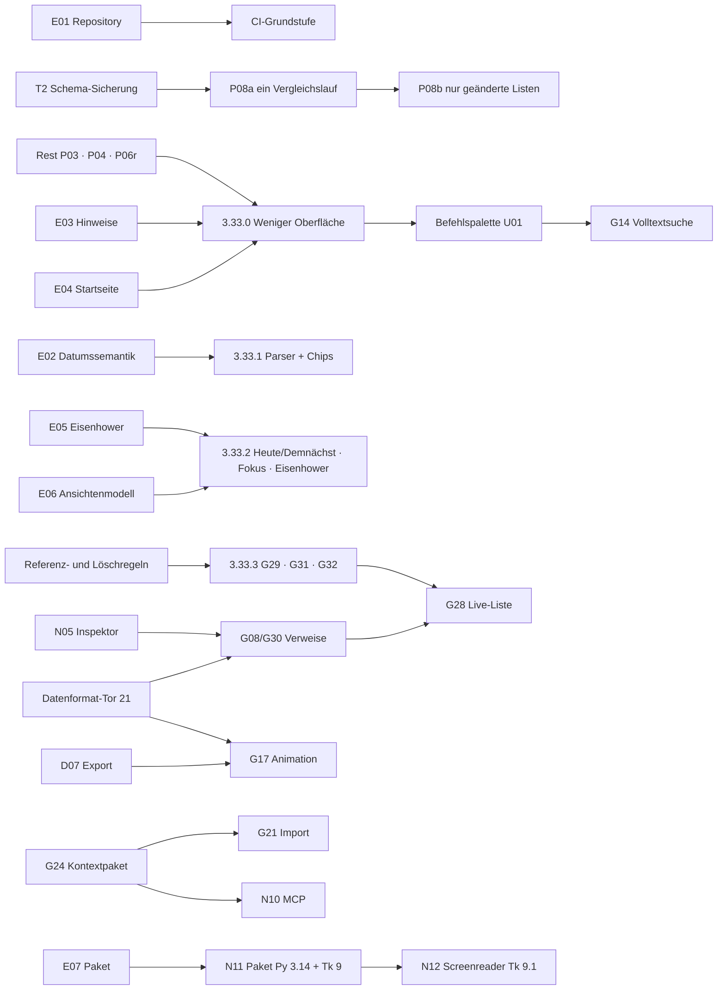

# Glide – Entwicklungsplan ab 3.33

Stand **01.10.2026** · Ausgangsstand Glide 3.32.3 (Aufgabenformat 20) · Teil 4 von 4 der Analyse vom 01.10.2026

Grundlagen:
- [Bestandsaufnahme Code und Dokumentation](Glide_Bestandsaufnahme_Code_und_Dokumentation_2026-10-01.md) (T-/A-Befunde)
- [Konkurrenz- und Featurematrix](Glide_Konkurrenz_und_Featurematrix_2026-10-01.md) (N-Vorschläge)
- [Produktprinzipien und UX-Prüfung](Glide_Produktprinzipien_und_UX-Pruefung_2026-10-01.md) (U-Befunde)
- [Entscheidungsvorlage E01–E10](Glide_Entscheidungsvorlage_2026-10-01.md)
- bestehende [Arbeits- und Featureplanung](Glide_Arbeits_und_Featureplanung_2026-09-30.md) (D01–D08, G-, P-Kennungen) und Aufgabenauswahl A-01 bis H-03

## 0. Verbindlichkeit

- **Verbindlich bleiben:** D01–D08, die Regeln der [Claude-Übergabe §6](CLAUDE_UEBERGABE_Glide_3.32.3.md) und der beauftragte Performance-Anschluss (Rest P03, P04/A-02, Rest P06/A-03).
- **Dieser Plan ist eine Empfehlung.** Er ordnet bestehende und neue Arbeiten, schätzt Aufwand und benennt Risiken. Die offene Auswahl A–H und E01–E10 entscheidet der Inhaber; bis dahin gilt keine Empfehlung als beauftragt.
- Zielversionen sind Planungsreservierungen, keine Liefertermine.

## 1. Ausgangslage in acht Sätzen

1. Glide ist funktional sehr breit und in der **Tagesplanung** auf dem Niveau spezialisierter Planer; Pixel-Werkstatt und Pinnwand mit echten Aufgaben sind im Vergleichsfeld einzigartig.
2. **Datensicherheit und Rückgängig** sind vorbildlich und dürfen durch keine Änderung geschwächt werden.
3. Die **größten funktionalen Lücken**:
   - Inhaltssuche,
   - Seitenverweise,
   - natürliche Eingabe mit sichtbarer Erkennung,
   - Aufgaben im Notiztext,
   - Fokusansicht,
   - Erinnerungen bei geschlossener App.
4. Die **größte Erlebnislücke** ist nicht fehlende Funktion, sondern zu viel dauerhaft sichtbare Bedienung: acht Kopfsymbole, Dauerhinweise, 12 Startseitenkacheln, doppelte Wege.
5. **Tempo:** Ansichtsaufbau wird bereits optimiert. Neu gemessen ist, dass jede Aktion linear mit dem Gesamtbestand kostet (56 ms bei 1.000, 458 ms bei 10.000 Punkten).
6. **Architektur:** Eine Klasse mit 41.000 Zeilen trägt Daten, Logik und Oberfläche. Das bremst Tests, ist aber kein Grund für einen Umbau in einem Schritt.
7. **Plattform:** macOS ist Referenz; Linux läuft, aber eingeschränkt; Windows ist ungeprüft; Installation braucht ein separates Python.
8. **Prozess:** Das Repository ist neu und enthält noch nicht Tests, Verträge und Werkzeuge; Git-Entscheidung offen (E01).

## 2. Produktstrategie

**Leitsatz:** *Glide ist der ruhige, lokale Arbeitsplatz für den eigenen Tag – planen, erledigen, festhalten; alles in einer eigenen Datei, ohne Konto. Die Pixel-Werkstatt ist die persönliche Signatur.*

Drei Säulen, in dieser Rangfolge:
1. **Verlässlich und schnell** – Daten sicher, jede Aktion unter 100 ms bei realistischen Beständen.
2. **Klarer Alltag** – ein mentales Modell (Heute, Demnächst, Listen, Seiten), Erfassen ohne Nachdenken, nur das Wesentliche sichtbar.
3. **Wissen im Kontext** – Aufgaben leben in Seiten und Notizen, Seiten verweisen aufeinander, alles ist auffindbar.

**Nicht-Ziele** (bestätigt bzw. neu begründet):
- Konten, Cloudservice, Teamfunktionen
- eingebaute Cloud-KI, Spracherfassung
- frei definierbare Datenbankfelder, Unterseiten, Graph
- Gewohnheiten (vorerst)
- Mobile (D03)
- Toolkit-Wechsel (D03)

## 3. Klassifizierung

| Klasse | Kriterium | Umgang |
|---|---|---|
| **N – notwendig** | Behebt gemessene Kosten, Fehlerrisiken, Widersprüche oder eine Lücke, die den Kernnutzen schwächt | Wird vor neuen Funktionen eingeplant |
| **S – sinnvoll** | Stärkt eine der drei Säulen, passt zu den Prinzipien, vertretbarer Aufwand | Nach Entscheidung in Stufen eingeplant |
| **Z – Zukunft** | Interessant, aber abhängig von externer Entwicklung, großer Abhängigkeit oder offener Produktgrenze | Beobachten; nicht vor Stufe 5 |
| **X – bewusst nicht** | Widerspricht Produktgrenze oder Prinzipien | Dokumentiert, nicht eingeplant |

Aufwand in **Arbeitstagen (AT) im bisherigen Arbeitsmodus**: KI-gestützte Umsetzung inklusive Bedienprobe, gezielter Suiten, Vollprüfung, Doku und Abgleich von 07/Bundle. S ≤ 0,5 AT · M 1–2 AT · L 3–5 AT · XL > 5 AT. Kalibriert an den bisherigen Schätzungen (Paket B 5–9 AT, C 7–12 AT); neue Punkte enthalten 10–20 % Zuschlag für Tk-freie Module mit Tests (E10).

## 4. Konsolidiertes Backlog

### 4.1 Notwendig (N)

| ID | Arbeit | Quelle | Begründung | Aufwand | Risiko | Stufe |
|---|---|---|---|---|---|---|
| P03r | Rest P03: Startseitenkarten, einzelne Kartenelemente, viele Karten | beauftragt | Startseite teuerste Ansicht (348 ms Linux-Probe) | M–L | mittel (Fokus/Scroll) | 0 |
| P04 | Bildlayout nur bei geänderter Geometrie | beauftragt, A-02 | Gemessen nötig vor Optimierung | M | mittel | 0 |
| P06r | Doppelte Refresh-/Schreibanforderungen | beauftragt, A-03 | Bestätigte Doppelarbeit | M | mittel (Fehlerpfade) | 0 |
| T2 | Eine Schema-Sicherungsprüfung statt neun | T2 | +0,65 s beim ersten Speichern (10 MB); 9 doppelte Methoden | S | gering | 0 |
| P08a | Ein Vergleichsdurchlauf für Verlauf, „zuletzt bearbeitet“, Aktivität | T1 | ≈ 80 % von `save_items` bei 10.000 Punkten | M | mittel | 0 |
| P08b | Nur geänderte Listen vergleichen, Vollvergleich im Autosave | T1 | Kosten pro Aktion unabhängig vom Bestand | M–L | mittel–hoch | 0 |
| DOK | Kommentare/Paket-README korrigieren (A4–A9), Mindestversion prüfen | A4–A9 | Widersprüche beseitigen | S | gering | 0 (nächster Schnitt) |
| G01 | Ein deutscher Eingabeparser mit Feldchips | G01, B-01, D01, E02 | Standard 2026; drei Parser heute | M–L | mittel | 1 |
| G14 | Volltextsuche (FTS5 als Cache) in der Befehlspalette | G14, D-01, P07 | Seiten ohne Inhaltssuche verlieren Wert | L | mittel | 2 |

### 4.2 Sinnvoll (S)

| ID | Arbeit | Quelle | Aufwand | Stufe |
|---|---|---|---|---|
| CI | Repository-Struktur und schnelle CI-Stufe (Linux, Xvfb, Startprobe, Tk-freie Tests, SHA-Abgleich) | E01, T4 | M | 0 |
| UX1 | **Weniger Oberfläche:** U01 Befehlspalette (N03), U02 Hinweise bei Bedarf, U03, U05-Standard, U07 Eingang (N02), U10 Kopfzeile, U13 Bibliothek, U14 Menü, U16 Begriffe, U19, U22, N01/U17 Automatisch hell/dunkel + Signaturdesign vorn | UX, E03, E04 | 5–8 AT | 1 |
| G05 | Fokusansicht an vorhandener Zeiterfassung | G05, B-02 | M | 1 |
| E06 | Heute/Demnächst | U06 | M | 1 |
| G02 | Eisenhower als Board-Gruppierung | G02, E05, D02 | M | 1 |
| H-02 | Tastaturwege für Ziehen (Verschieben per Tastatur in Board/Mein Tag/Kalender) | H-02 | M | 1 |
| N08 | JPEG-Vorschau Linux über Systemwerkzeug | T5 | S | 1 |
| N06/N07 | „Erste Schritte“-Seite, „Neu in …“-Karte | U21 | M | 1 |
| G29 | Aufgaben im Notiztext (gleiche IDs) | G29, C-01, D05 | L | 1 |
| G31 | Seitenaufgabe über ID in Liste schicken | G31, C-02 | M | 1 |
| G32 | Filter „aus Seiten“ | G32, C-03 | S | 1 |
| N04 | Kalender als eingebettete Ansicht, Ziehen auf Tage (D02) | U11, B-03 | L | 2 |
| N05 | Ein Inspektor statt Maske + Detailbereich | U12 | L | 2 |
| U18 | Seitentitel im Dokument, Platzhalter | U18 | M | 2 |
| U09 | Kompakte Pinnwandleiste | U09 | M | 2 |
| U08 | Vorlagen im Anlegen-Weg, gefüllte Vorschau | U08, E-03 | M | 2 |
| U15/U20 | Lila nur für Hinzufügen; Leerzustände ohne doppelten Anlegen-Knopf | U15, U20 | S | 2 |
| G08/G30 | Seiten-/Listenverweise, Rückverweise (Format-21-Tor) | G08/G30, D-02 | L–XL | 2 |
| G28 | Live-Liste in Seite | G28, E-01 | L | 2 |
| G09 | Titelbild für Seiten und Bibliothekskarten | G09, E-02 | M | 2 |
| D-03 | Filterwirkung erklären (warum ist etwas sichtbar/ausgeblendet) | D-03 | S | 2 |
| G19 | Palettenbearbeitung mit Undo | G19, G-01 | M–L | 3 |
| G17 | Animation (D07) | G17, G-02 | XL | 3 |
| G-03 | Symbolvorschau 16/32/48 px | G-03 | S–M | 3 |
| G24 | Kontextpaket, Markdown/Felder, Änderungsdiff | G24, F-01 | L | 4 |
| G21 | Begrenzter Notion-/Todoist-Import mit Verlustbericht | G21, F-02 | L | 4 |
| F-03 | Sicherungsvergleich | F-03 | M | 4 |
| N11 | Paket mit eingebettetem Python 3.14 + Tk 9 je Plattform | H-03, G26, E07 | L–XL | 4 |
| H-01 | Kontrollmatrix fortführen | H-01 | laufend | alle |

### 4.3 Zukunft (Z) und bewusst nicht (X)

| ID | Thema | Klasse | Auslöser für Neubewertung |
|---|---|---|---|
| N10 | Lokaler MCP-Server (lesend → Vorschläge mit Bestätigung) | Z | Nach G24; MCP-Spezifikation stabil |
| N12 | Screenreader über Tk 9.1 `tk accessible`, Canvas-Bedienelemente beschriften (U23) | Z | Stabile Tk-9.1-Freigabe + N11 |
| N09 | Erinnerungen bei geschlossener App (Systemplaner oder ICS-Abo) | Z | Eigene Entscheidung „Hintergrunddienst ja/nein“ |
| N13 | Seitenversionen wiederherstellen | Z | Nach F-03 |
| N14 | Systemweiter Erfassungs-Hotkey | Z | Nur mit Paket (N11) |
| – | Mobile Begleit-App, Sync mit Zusammenführen | Z | D03 aufheben |
| – | SQLite als Hauptspeicher | Z | Reale Bestände > 20.000 Punkte (E09) |
| – | Toolkit-Probe G25 | Z | D03 aufheben |
| N15–N20 | Spracherfassung, Gewohnheiten, Teamfunktionen, freie DB-Felder, Unterseiten/Graph, Web Clipper | X | – |

### 4.4 Zuordnung der offenen Aufgabenauswahl (A–H)

| Aufgabe | Stand / Zuordnung |
|---|---|
| A-01 | erledigt (3.32.3) |
| A-02, A-03 | Stufe 0 (beauftragt) |
| B-01, B-02 | Stufe 1 (G01, G05) |
| B-03 | Stufe 2 mit N04 (freie Zeitfenster im eingebetteten Kalender) |
| C-01, C-02, C-03 | Stufe 1 (G29, G31, G32) |
| D-01, D-02 | Stufe 2 (G14, G08/G30) |
| D-03 | Stufe 2 |
| E-01, E-02 | Stufe 2 (G28, G09) |
| E-03 | Stufe 2 (mit U08) |
| F-01, F-02, F-03 | Stufe 4 |
| G-01, G-02, G-03 | Stufe 3 |
| H-01 | laufend |
| H-02 | Stufe 1 |
| H-03 | Stufe 4 (N11, E07) |

## 5. Ausbaustufen

### Stufe 0 – Fundament (3.32.4 ff.) · ≈ 9–14 AT

- **Ziel:** Jede Aktion bleibt bei wachsendem Bestand schnell; Dokumentation und Repository sind eine verlässliche Grundlage.
- **Inhalt:**
  - P03r, P04, P06r (beauftragt)
  - T2, P08a, danach Messung, dann P08b
  - DOK
  - E01 und CI-Grundstufe
- **Reihenfolge:**
  1. T2 als kleinster, sicherer Schnitt mit sofort messbarem Gewinn.
  2. Rest P03 – Startseite, kombinierbar mit E04, wenn entschieden.
  3. P04, P06r.
  4. P08a.
  5. Messung.
  6. P08b.
- **Fertig, wenn:**
  - Abhaken bei 5.000 Punkten ≤ 120 ms auf der Linux-Referenz-VM mit Python 3.14 (heute 232 ms); auf dem Mac des Inhabers vergleichbar gemessen.
  - Erstes Speichern ohne Zusatz-Parse.
  - Verlauf und „zuletzt bearbeitet“ sind identisch zum alten Verfahren (Differenztest über Zufallsänderungen).
  - Vollprüfung grün; 07/Bundle per SHA-256 abgeglichen.
- **Risiken:** R4 (übersehene Mutationswege), R11 (Messplattform).

### Stufe 1 – Klarer Alltag (3.33.x) · ≈ 17–27 AT in vier Schnitten

| Schnitt | Inhalt | Aufwand | Voraussetzung |
|---|---|---|---|
| 3.33.0 | UX1 „Weniger Oberfläche“ inkl. N01 | 5–8 AT | E03, E04; R2 beachten |
| 3.33.1 | G01 Parsermodul + Feldchips (U04), N08 | 3–4 AT | E02 |
| 3.33.2 | E06 Heute/Demnächst, G05 Fokus, G02 als Board-Gruppierung, H-02 Tastaturwege | 4–7 AT | E05, E06 |
| 3.33.3 | G29, G31, G32; N06/N07 | 5–8 AT | Referenz- und Löschregeln (Abschnitt 6) |

- **Ziel:** Ein klares mentales Modell, Erfassen ohne Nachdenken, Aufgaben im Text.
- **Fertig, wenn:**
  - Kopfzeile ≤ 4 Symbolknöpfe;
  - Bedienfläche über dem Inhalt ≤ 15 % bei 1280 × 800 (heute Liste ≈ 27 %);
  - Startseite Standard ≤ 5 Kacheln (heute 12);
  - Eingabe „Angebot schicken morgen bis Freitag /wichtig“ zeigt vor dem Speichern die Chips Bearbeitungstag, Fälligkeit und Wichtigkeit, jeweils einzeln rücknehmbar;
  - eine Aufgabe in einer Notiz ist dieselbe ID in Liste und Text; Löschen der Zeile legt sie in den Papierkorb (Undo);
  - Fokuszeit wird genau einmal gebucht, auch nach Pause, Wechsel und Neustart.
- **Risiken:** R1, R2, R9.

### Stufe 2 – Wissen im Kontext (3.34.x) · ≈ 20–33 AT

| Schnitt | Inhalt | Aufwand |
|---|---|---|
| 3.34.0 | N05 Inspektor, U18 Seitentitel, U15/U20, U08/E-03 | 5–8 AT |
| 3.34.1 | G14 Volltextsuche in der Befehlspalette, D-03 | 3–5 AT |
| 3.34.2 | **Datenformat-Tor 21**, G08/G30 Verweise + Rückverweise | 4–7 AT |
| 3.34.3 | G28 Live-Liste, G09 Titelbild | 4–6 AT |
| 3.34.4 | N04 Kalender eingebettet (+ B-03), U09 Pinnwandleiste | 4–7 AT |

- **Ziel:** Alles auffindbar, Seiten verbunden, Bearbeitung an einem Ort.
- **Fertig, wenn:**
  - Suche findet Wörter in Seiten-, Notiz- und Beschreibungstext; Index fehlt/defekt → Glide öffnet trotzdem und baut neu auf.
  - Umbenennen, Verschieben, Papierkorb und Import erhalten Verweise; „Ziel fehlt“ ist sichtbar.
  - Ältere Fassungen öffnen Format 21 nur schreibgeschützt.
  - Kalender ohne modales Fenster.
- **Risiken:** R3 (Datenformat), R1.

### Stufe 3 – Pixel (3.35.x) · ≈ 8–12 AT

- **Inhalt:** G19 Palettenbearbeitung/Undo → G-03 Symbolvorschau → G17 Animation nach D07.
- **Formatsprung:** nur, wenn Animation oder Transparenz es verlangt (Format 22 bzw. Einordnung nach 21).
- **Fertig, wenn:** Bestand bleibt lesbar, Frame-/Dateigrenzen dokumentiert, Export reproduzierbar.

### Stufe 4 – Austausch und Verteilung (3.36.x) · ≈ 10–18 AT

- **Inhalt:**
  - G24 Kontextpaket mit Änderungsdiff → G21 Import (Notion/Todoist) mit Verlustbericht
  - F-03 Sicherungsvergleich
  - N11 Paket mit eingebettetem Python 3.14 + Tk 9 (E07)
  - Windows-/Linux-Abnahme mit Checkliste
- **Fertig, wenn:**
  - Importvorschau zeigt Verluste vor dem Übernehmen;
  - veraltete Vorschläge überschreiben nichts still;
  - Pakete starten auf sauberem macOS/Windows/Linux ohne separates Python;
  - Symbole und JPEG-Vorschau gleich auf allen Plattformen.

### Stufe 5 – Zukunft (4.x, ohne Termin)

- N10 lokaler MCP-Server, N12 Screenreader (Tk 9.1), N09 Erinnerungen bei geschlossener App, N13 Seitenversionen, N14 Hotkey.
- Mobile/Sync nur nach Aufhebung von D03.

## 6. Abhängigkeiten

**Referenz- und Löschregeln vor G29/G31/G28** (aus der Planung übernommen, präzisiert):
- Eine Aufgabe hat genau einen Heimatort (Liste, Seite oder Notiz).
- Andere Orte zeigen einen Verweis.
- Entfernt man eine Verweiszeile, entfernt das nur den Verweis.
- Entfernt man die Zeile am Heimatort, wandert die Aufgabe in den Papierkorb; alle Verweise zeigen dann „im Papierkorb“ bzw. nach Endgültig-Löschen „Ziel fehlt“.
- Undo stellt beides zusammen her.

## 7. Risiken

| Nr. | Risiko | W | A | Gegenmaßnahme |
|---|---|---|---|---|
| R1 | Regressionen in der 41.000-Zeilen-Klasse bei Oberflächenumbauten | mittel | hoch | Kleine Schnitte; Bedienproben über echte Bindungen (D08-Muster); CI-Startprobe; Vollprüfung je Schnitt |
| R2 | Menübeschriftungen sind Schlüssel für `ACTION_GROUPS`/App-Aktionen (Kommentar in `menubar_structure`). Umbenennen (U14/U16) bricht Zuordnungen | hoch | mittel | Vor Umbenennung stabile Aktionskennungen einführen, Beschriftung davon trennen; Test „jede Aktion erreichbar“ |
| R3 | Neue Dokumentinhalte (Verweise, Einbettung, Cover, Animation) gehen in älteren Fassungen verloren | mittel | hoch | Datenformat-Tor 21: Vorsicherung, Migration, Altleser schreibgeschützt, Tests |
| R4 | P08b übersieht einen Änderungsweg → Verlauf/„zuletzt“ unvollständig | mittel | mittel | Vollvergleich bleibt im Autosave; Differenztest alt/neu über zufällige Änderungsfolgen |
| R5 | Windows/Linux ungetestet | hoch | mittel | Linux-CI; Windows-Checkliste; E07 |
| R6 | Tk 9.1 verzögert sich oder bringt Verhaltensänderungen | mittel | gering | Barrierefreiheit nicht zusagen; auf 9.0 weiterentwickeln |
| R7 | Umfang wächst (24 offene Aufgaben + neue Ideen) | hoch | mittel | Klassifizierung, Prinzipien-Check (UX-Prüfung §4), Stufen nicht vermischen |
| R8 | Wissen und Prüfwerkzeuge nur lokal (Busfaktor) | mittel | hoch | E01 B |
| R9 | Gewohnheitsbruch (E02, E04, E06) | mittel | gering | Bestandseinstellungen bleiben; „Neu in …“-Karte (N07) |
| R10 | Namenskollision „Glide“ bei Veröffentlichung | – | mittel | Markenprüfung durch Inhaber vor jeder öffentlichen Verteilung |
| R11 | Messungen der Linux-VM nicht auf den Mac übertragbar | hoch | gering | Abnahme immer auf dem Referenz-Mac; VM nur für Trends/CI |

W = Wahrscheinlichkeit, A = Auswirkung.

## 8. Priorisierung – warum diese Reihenfolge

1. **Fundament vor Funktion:**
   - T1/T2 sind gemessen und wirken bei jeder Aktion.
   - Die Performance-Arbeit ist bereits beauftragt.
   - Ohne CI und Repository (E01) wird jeder weitere Schnitt teurer.
2. **Oberfläche entschlacken vor neuen Funktionen:** Jede neue Funktion braucht einen Ort. Erst nach UX1 gibt es die Befehlspalette, die Kopfzeile und die Hinweislogik, in die sich G01, G05 und G14 einfügen, statt weitere Knöpfe zu erzeugen.
3. **Planen vor Wissen:**
   - Tagesplanung ist Glides stärkstes Unterscheidungsmerkmal und täglich genutzt.
   - G01/G05 sind klein und sofort spürbar.
   - Die Wissensetappe braucht das Datenformat-Tor.
4. **Pixel und Austausch danach:** Wertvoll als Signatur bzw. Umstiegshilfe, aber seltener genutzt; D07 offen.
5. **Zukunftsthemen** hängen an externen Entwicklungen (Tk 9.1, MCP) oder an Produktgrenzen.

Empfehlung für die nächste Featurewahl nach der Performance (bestätigt die Übergabe): **B-01 (G01) vor C-01 (G29)**. G01 ist kleiner, ohne Datenformatfragen und profitiert direkt von UX1.

## 9. Messbare Ziele

| Bereich | Ziel | Heute (Beleg) |
|---|---|---|
| Abhaken, 1.000 Punkte | ≤ 50 ms | 56 ms (Linux-VM, 3.14) |
| Abhaken, 5.000 Punkte | ≤ 120 ms | 232 ms |
| Abhaken, 10.000 Punkte | ≤ 200 ms | 458 ms |
| Erstes Speichern, 10 MB | ≤ Folgespeichern + 50 ms | +660 ms |
| Startseite aufbauen (Beispieldaten) | ≤ 150 ms | 348 ms (Linux, 3.12) |
| Kopfzeilen-Symbolknöpfe | ≤ 4 | 8 |
| Bedienfläche über Inhalt (Liste, 1280 × 840) | ≤ 15 % | ≈ 27 % |
| Startseitenkacheln im Standard | ≤ 5 | 12 |
| Doppelte Bedienoberflächen (U01, U08, U12, U13) | 0 | 4 |
| CI | jede Änderung: Startprobe + Tk-freie Tests + SHA-Abgleich grün | nicht vorhanden |

Ziele auf der Linux-Referenz-VM gelten als Trend. Verbindlich ist die Messung auf dem Referenz-Mac mit Aufwärmen, Median und p95 (Übergabe §6).

## 10. Nächste konkrete Schritte

1. **Inhaber:** E01–E10 beantworten (Kurzform genügt); D07 bleibt bis Stufe 3 offen.
2. **3.32.4 – kleinster belegbarer Schnitt:** T2 (eine Schema-Sicherungsprüfung). Baseline mit `persistenz_messung.py`, Vorsicherungstest je Formatstufe, Vollprüfung, Abgleich.
3. **Beauftragte Performance-Fortsetzung:** Rest P03 Startseite, dann P04 und P06r gemäß Übergabe §4; danach P08a mit Differenztest.
4. **Bei E01 B:** `01_Repository/Glide` (src, tests, docs, scripts, CHANGELOG) ins Repository übernehmen; CI-Grundstufe aus [`Analyse_2026-10-01/werkzeuge`](Analyse_2026-10-01/werkzeuge/) ableiten.
5. **3.33.0 vorbereiten:** Aktionskennungen von Menübeschriftungen entkoppeln (R2), dann UX1 in der Reihenfolge U07, U03, U10, U19, U22, U13, U14, N01, U02, U05, U01, U16.

## 11. Pflege dieses Plans

- Lebendes Dokument: Bei jeder Produktionsrunde den Stand der IDs nachführen (erledigt/verschoben) und die Vorfassung gemäß Archivregel sichern.
- Die Arbeits- und Featureplanung vom 30.09. bleibt Beleg für D01–D08. Neue Entscheidungen werden dort bzw. in der Entscheidungsvorlage datiert eingetragen, nicht hier.
- Neue Ideen erst nach dem Prinzipien-Check ([UX-Prüfung §4](Glide_Produktprinzipien_und_UX-Pruefung_2026-10-01.md#4-prinzipien-check-für-jede-neue-funktion-vorlage)) und mit Klasse N/S/Z/X aufnehmen.
