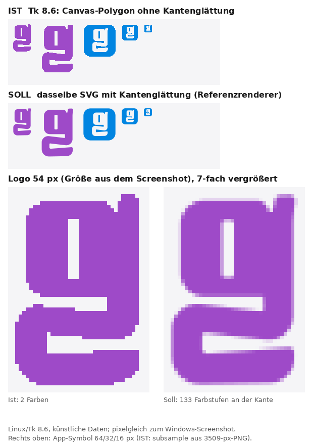
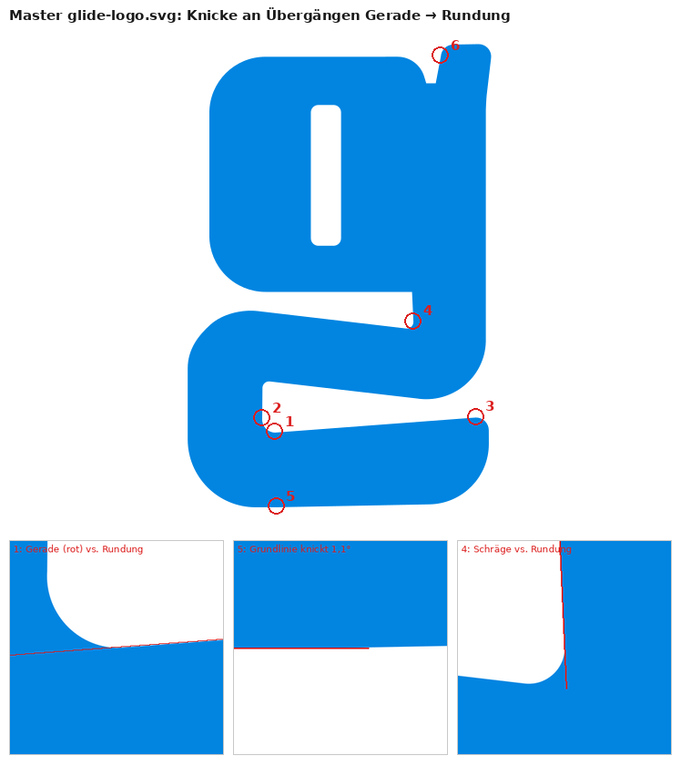

# Fehlerdiagnose: Logo ohne Kantenglättung unter Tk 8.6

Stand 10.10.2026 · Glide 3.36.0 · Datenformat 23

**Status:** Diagnose abgeschlossen, Umsetzung offen. Die Auswahl der Lösungswege (Abschnitt 7) liegt beim Inhaber; bei der Diagnose wurden weder Code noch Master geändert. Nachstellungen: Linux/Tk 8.6, künstliche Daten.

**Übernommen am 05.10.2026:** Tk-Fallstricke in die [Architektur](../02_ARCHITECTURE.md#zeichnen-und-bilder), Grenzen in die [Funktionen](../20_FUNKTIONEN.md#13-bekannte-grenzen), Masterbefunde in den [Grafik-Master](../../../../20_Grafik_Master/README.md), Aufgaben LG01–LG04 und die Auswahl I8 in den [Entwicklungsplan](../../../../00_Arbeitsvorbereitung/Glide_Entwicklungsplan.md), Sichtprüfung in die [Prüfliste](../../../../00_Arbeitsvorbereitung/Glide_Manuelle_Pruefung.md) (B5). Weg A gilt für die Windows-Prüflaufzeit: In der Aufnahme vom 05.10.2026 (Python 3.14.8/Tk 9.0.4) hat das Logo 116 Farbwerte statt 2. Die Standardinstallation des Inhabers ist unverändert.

**Lebensdauer:** Zwischenablage im Sinne der [Dokumentenpflege](../DOKUMENTENPFLEGE.md). Sobald die gewählten Wege umgesetzt und ihre gültigen Ergebnisse in [Architektur](../02_ARCHITECTURE.md), [Funktionen](../20_FUNKTIONEN.md), [Entwicklungsplan](../../../../00_Arbeitsvorbereitung/Glide_Entwicklungsplan.md) und [Grafik-Master](../../../../20_Grafik_Master/README.md) übernommen sind, wird dieses Dokument samt Bildern gelöscht.

## 1 Symptom

Das Logo in der Kopfzeile wirkt unter Windows treppig; geneigte Kanten und Rundungen haben keine saubere Linienführung, obwohl der Master als SVG vorliegt. Screenshot vom 05.10.2026 (Ansicht „Vorlagen“, Akzentfarbe Lila): Das Zeichen ist 35 × 54 px groß und besteht aus genau zwei Farbwerten, Logofarbe und Hintergrund. An der Kante gibt es keine Zwischentöne.

## 2 Ursache

Die ursprüngliche Windows-Prüfung lief mit Python 3.12.10 und Tk 8.6 ([QA-Bericht](../07_QA_BERICHT.md)). Seit 05.10.2026 steht daneben Python 3.14.8/Tk 9.0.4 für die Windows-QA bereit; die Standardinstallation wurde nicht geändert. Tk 8.6 liest kein SVG; Glide nimmt dann den Rückfallweg:

| Schritt | Stelle | Verhalten unter Tk 8.6 |
|---|---|---|
| Logo zeichnen | `ListApp.draw_logo` in `app.pyw` | ruft zuerst `logo_photo` |
| SVG-Probe | `has_svg` in [logo.py](../../src/glide/logo.py) | liefert `False`; `logo_photo` gibt `None` zurück |
| Rückfall | `draw_logo_polygons` | zerlegt den Pfad über `svg_geometry.subpaths` (10 Schritte je Bézierkurve) und `canvas_polygons` (Brücke zum Innenraum) in Polygone |
| Rasterung | `Canvas.create_polygon` | Tk füllt Canvas-Flächen unter Windows (GDI) und X11 ohne Kantenglättung: Jedes Pixel ist ganz Logofarbe oder ganz Hintergrund. |

Betroffen sind alle drei Aufrufer: Kopfzeile (`sync_header_logo`), „Über Glide“ (Leinwand `about_logo`, `ABOUT_LOGO_HEIGHT`) und Startfenster (`show_start_window`, 96 px).

Nicht betroffen sind macOS mit Tk 9, die Referenz der Abnahme: Dort rechnet Tk das SVG über nanosvg geglättet (`format="svg -scaletoheight …"`). Ebenso die Paketsymbole in `assets/icons`, die `packaging/baue_symbole.py` unter Tk 9 erzeugt.

Besonders auffällig wird der Mangel, weil das Zeichen mehrere flach geneigte Kanten (1–7°) hat. Ohne Glättung wird jede zu einer einzelnen Pixelstufe und liest sich als gebrochene Linie.

## 3 Nachweise

1. **Screenshot:** zwei Farbwerte im Zeichen (Abschnitt 1).
2. **Nachstellung:** `draw_logo_polygons` unter Tk 8.6 (Xvfb) in 54 px Höhe ergibt ein Bild, das mit dem Windows-Screenshot zu 100 % pixelgleich ist.
3. **Geometrie korrekt:** Die Polygone weichen bei 1000 px Höhe nur um 0,3 % der Fläche vom gerenderten SVG ab, ausschließlich an Kantenpixeln. Die Ursache liegt allein in der Rasterung, nicht in der Umrechnung.
4. **Vergleich Ist/Soll:**



## 4 Warum die Prüfung es nicht gefunden hat

- Abgenommen wird maßgeblich auf macOS mit Tk 9; dort ist der SVG-Weg aktiv.
- [test_logo330](../../tests/integration/test_logo330.py) prüft beim Rückfall nur Elementtyp (`polygon`), Füllfarbe und Begrenzungsrahmen (± 2 px), nicht die Darstellungsqualität.
- [Funktionen](../20_FUNKTIONEN.md) führt „Logo unter Tk 8.6“ unter Windows ausdrücklich als ungeprüft.

## 5 Weitere Befunde zur Laufzeit

| Nr. | Befund | Stelle | Auswirkung |
|---|---|---|---|
| L1 | Das App-Symbol lädt unter Tk 8.6 das PNG mit 3509 × 3508 px vollständig und verkleinert es mit `subsample`, das nur jedes n-te Pixel übernimmt (keine Filterung). | `icon_photos`, Aufrufer `apply_window_icon` und `app_icon_photo` | Fenster- und Taskleistensymbol treppig; aus 256 px werden 251 px. Das Laden dauert rund 0,5 s (gemessen unter Linux/Tk 8.6) und liegt beim Start vor dem ersten `update()` des Startfensters. |
| L2 | `glide-logo.png` wird nirgends verwendet. Der Modulkopf von `logo.py` nennt die PNGs „für Tk 8.6“; tatsächlich nutzt nur das App-Symbol sein PNG. | `logo.py` (`LOGO_PNG`), [Grafik-Master](../../../../20_Grafik_Master/README.md) | Laufzeitballast ohne Nutzen (87 KB), irreführende Beschreibung |

## 6 Befunde am Master (Gestaltung)

Seit 05.10.2026 im [Grafik-Master](../../../../20_Grafik_Master/README.md#befunde-am-logo-master-05102026-entscheidung-beim-inhaber) geführt: Knicke an Übergängen Gerade → Rundung, fast achsparallele Geraden, ein Kurzsegment und der zulaufende Innenraum bei 16–32 px.



## 7 Lösungswege

Reihenfolge nach Nutzen und Aufwand. Die Auswahl ist offen.

| Weg | Inhalt | Aufwand | Hinweise |
|---|---|---|---|
| A | Windows-Arbeitsumgebung auf Python 3.14.7 oder neuer umstellen. Dessen Windows-Builds bringen Tcl/Tk 9.0.4 mit (gh-124111); dann gilt der SVG-Weg ohne Codeänderung. | gering | Entspricht E-01/D15 ([Arbeitsrichtung](../ARBEITSRICHTUNG.md)). Die tkdnd-Bibliotheken für Windows mit Tcl 9 liegen bei (`vendor/tkinterdnd2/tkdnd/win-x64-tcl9`). Prüfen mit `py -3.14 -c "import tkinter; print(tkinter.TkVersion)"`, erwartet 9.0. Windows mit Tk 9 ist eine neue Kombination und braucht einen eigenen Prüflauf. |
| B | Tk-8.6-Rückfall geglättet: Ein Tk-freies Modul (D17) rastert die Umrisse aus `svg_geometry.outline` mit Flächenanteil je Pixel (Scanline, gerade-ungerade-Regel), schreibt ein RGBA-PNG mit `zlib` (PNG-Kodierung gibt es in `drawing.py`) und übergibt es als `tk.PhotoImage(data=…)`. Ersetzt `canvas_polygons` für die Anzeige. | mittel | Machbarkeitsprobe außerhalb des Repositorys: 14 ms bei 54 px, 28 ms bei 96 px, 37 ms bei 128 px, 69 ms bei 200 px. Tk 8.6 stellt den Alphakanal korrekt dar (106 Farbstufen bei 54 px statt 2). Nur Standardbibliothek. Abnahme unter Windows offen. |
| C | App-Symbol vorgerechnet: `baue_symbole.py` legt zusätzlich 16, 32, 64 und 256 px als PNG in `resources/logo` ab; `icon_photos` lädt sie unter Tk 8.6 direkt. | gering | Farbe und Größen sind fest, Vorrechnen passt hier. Beseitigt L1 einschließlich der rund 0,5 s beim Start. Änderungen an `src/glide/resources` nur in einer Produktionsrunde (Lieferstand, SHA-256). |
| D | Prüfung schärfen: `test_logo330` verlangt für beide Wege Zwischentöne an der Kante (zum Beispiel mindestens 20 Farbwerte im Logo bei 54 px); Sichtprüfung des Logos unter Windows in die manuelle Prüfliste. | gering | Hätte den Fehler gefunden. |
| E | Master überarbeiten: Rundungen tangential an die geneigten Geraden anpassen, Kleinstabweichungen entscheiden, Kurzsegment entfernen; optional eine Kleingrößenfassung für 16–32 px mit breiterem Innenraum. | Gestaltung | Danach Ablauf „Einen Master ändern“ im [Grafik-Master](../../../../20_Grafik_Master/README.md). |
| F | Dokumentation: Tk-Fallstrick „Canvas ohne Kantenglättung unter Windows und X11“ in die [Architektur](../02_ARCHITECTURE.md); Modulkopf von `logo.py` und [Grafik-Master](../../../../20_Grafik_Master/README.md) zu den PNGs berichtigen. | gering | Zusammen mit dem gewählten Weg umsetzen. |

**Nicht empfohlen:**

- Pillow oder aggdraw: verletzt die [Produktgrenze](../01_PRODUCT_CONSTRAINTS.md) „nur Standardbibliothek“.
- Vorgerechnete PNGs für das Logo in Kopfzeile, „Über Glide“ und Startfenster: Höhe (Schriftgröße, DPI) und Akzentfarbe wechseln zur Laufzeit.
- `zoom` oder `subsample` unter Tk 8.6: Beide arbeiten ohne Filterung.

## 8 Nachstellung

Ohne Nutzerdaten, mit `python3 -B` und Tk 8.6 unter Xvfb aus `01_Repository/Glide`:

```python
import sys, tkinter as tk
sys.path.insert(0, "src/glide")
import logo
root = tk.Tk()
leinwand = tk.Canvas(root, bg="#F5F5F7", highlightthickness=0, width=80, height=80)
leinwand.pack()
logo.draw_logo_polygons(leinwand, 10, 10, 54, "#9E4AC8")
root.update()
# Fenster aufnehmen, etwa mit ImageMagick: import -window root bild.png
# Ergebnis: Das Zeichen enthält genau zwei Farbwerte.
```

Für das Soll-Bild wurde dasselbe SVG, auf den Zeichenrahmen zugeschnitten (`cropped_svg`) und eingefärbt (`tinted`), mit einem Referenzrenderer in derselben Höhe gerechnet. Der Referenzrenderer gehört nicht zu Glide.

## 9 Quellen

- [Python 3.14 – Changelog](https://docs.python.org/3.14/whatsnew/changelog.html): gh-124111, Windows-Builds mit Tcl/Tk 9.0.4 ab Python 3.14.7
- [Python 3.14.7](https://www.python.org/downloads/release/python-3147/), veröffentlicht am 05.08.2026
- [TIP 507](https://core.tcl-lang.org/tips/doc/trunk/tip/507.md): SVG-Bildformat für Tk über nanosvg
- [Tk-Handbuch `photo`](https://www.tcl-lang.org/man/tcl8.6/TkCmd/photo.htm): `-subsample` übernimmt nur jedes n-te Pixel
- [tkpath](https://wiki.tcl-lang.org/revision/tkpath?V=9): geglättete Canvas-Darstellung nur als Erweiterung mit eigenen Zeichen-Backends
